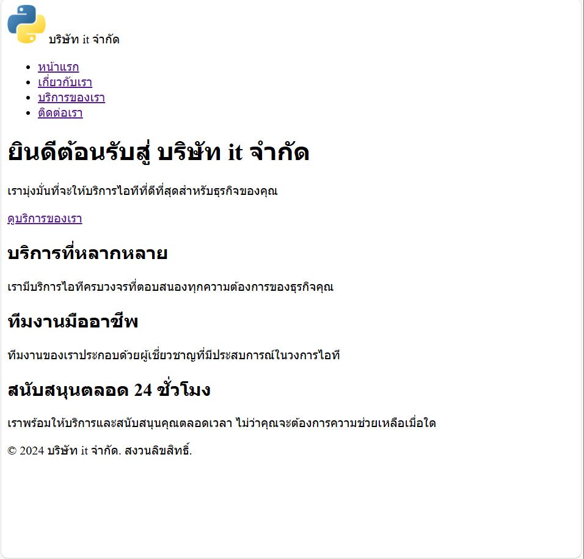
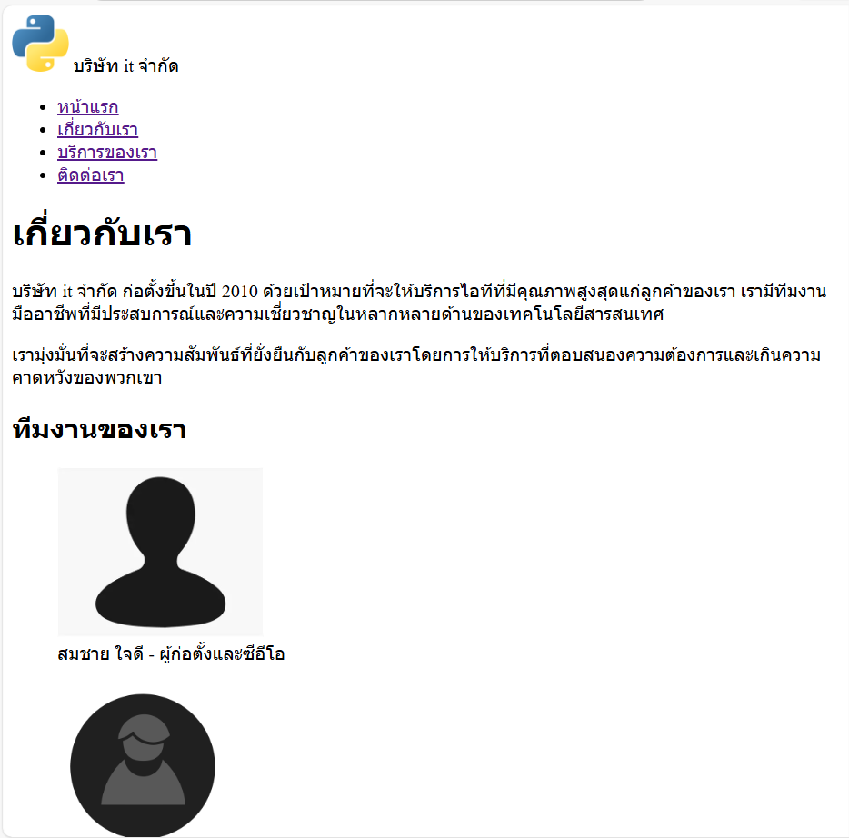
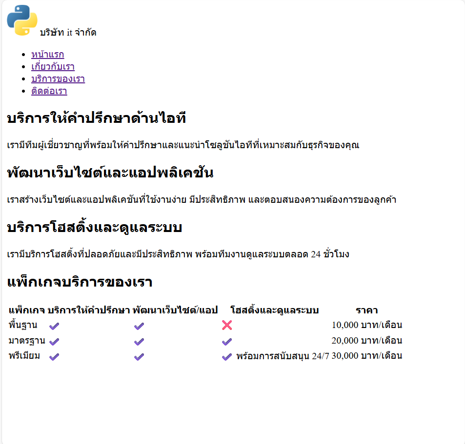
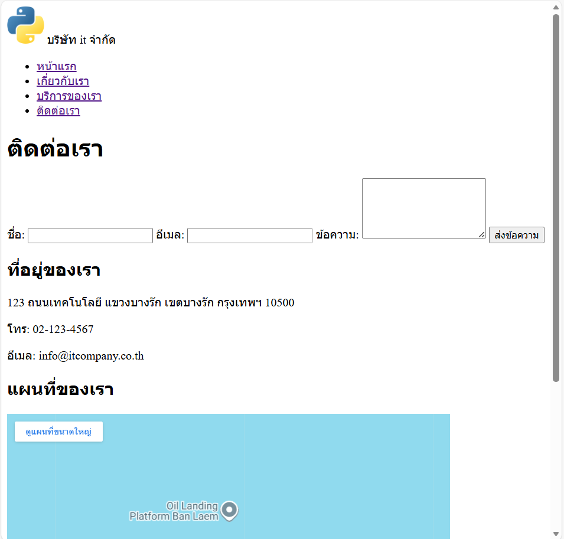

# My Business Web - IT Solutions Partner

## คำอธิบายโครงการ

* เว็บไซต์ธุรกิจของ **IT Solutions Partner** (บริษัทรับทำเว็บไซต์และโซลูชันไอที)
* สร้างขึ้นเพื่อส่งงาน Assignment #1 โดยเน้นการสร้างเว็บไซต์แบบ Static พื้นฐาน
* เน้นการใช้ **HTML Semantic** ที่ถูกต้อง (ตามข้อกำหนดโดยยังไม่เน้น CSS หรือ JavaScript ซับซ้อน)
* เรียนรู้การจัดโครงสร้างหน้าเว็บ (Layout), การลิงก์ระหว่างหน้า (Navigation), และการสร้างฟอร์ม

## ไฟล์ที่สร้าง

* **index.html** - หน้าแรกของเว็บไซต์ แสดงส่วน Hero Banner, บริการแนะนำ (Featured Services)
* **about.html** - หน้าข้อมูลบริษัท: ประวัติความเป็นมา, ทีมงานผู้เชี่ยวชาญ, และวิสัยทัศน์องค์กร
* **services.html** - หน้าแสดงรายละเอียดบริการ (Web Dev, SEO, Support) และตารางเปรียบเทียบราคาแพ็กเกจ
* **contact.html** - หน้าติดต่อเรา มีฟอร์มส่งข้อความ, ที่อยู่สำนักงาน, และ Google Maps

## โครงสร้างหน้าเว็บ (ตามความต้องการของลูกค้า)

### 1. หน้าแรก (index.html)
* 1.1 Header (Logo / ชื่อบริษัท IT Solutions Partner)
* 1.2 Navigation menu (หน้าแรก, เกี่ยวกับ, บริการ, ติดต่อ)
* 1.3 Hero section (ขนาดใหญ่ เนื้อหา Welcome สู่โลกเทคโนโลยี)
* 1.4 Featured services (3 บริการหลัก: Web Design, Digital Marketing, IT Support)
* 1.5 Footer

### 2. หน้า About (about.html)
* 2.1 เรื่องราวของบริษัท (Company Story)
* 2.2 ทีมงาน (ใช้ `<figure>` สำหรับรูปโปรไฟล์ Developer และ CEO)
* 2.3 Mission/Vision (พันธกิจและวิสัยทัศน์)
* 2.4 Link กลับหน้าแรก

### 3. หน้า Services (services.html)
* 3.1 รายการบริการทั้งหมด
* 3.2 ใช้ `<section>` แยกสำหรับแต่ละบริการ
* 3.3 Table เปรียบเทียบแพ็กเกจราคา (Starter vs Pro vs Enterprise)

### 4. หน้า Contact (contact.html)
* 4.1 มี Contact Form สำหรับกรอกข้อมูล (ชื่อ, อีเมล, ข้อความ)
* 4.2 ที่อยู่ของบริษัท (Address)
* 4.3 แผนที่ (Embedded Google Maps)

## All pages with direct links

| หน้า | ลิงก์ | รูปภาพตัวอย่าง |
| :--- | :--- | :--- |
| **[หน้าแรก](index.html)** | `index.html` |  |
| **[เกี่ยวกับ](about.html)** | `about.html` |  |
| **[บริการ](services.html)** | `services.html` |  |
| **[ติดต่อ](contact.html)** | `contact.html` |  |

## How to Run

1.  เปิด `index.html` ใน Browser (Chrome, Edge, Firefox) เพื่อดูผลลัพธ์
2.  หรือเปิดผ่าน **Live Server** ใน VS Code เพื่อจำลอง Local Server